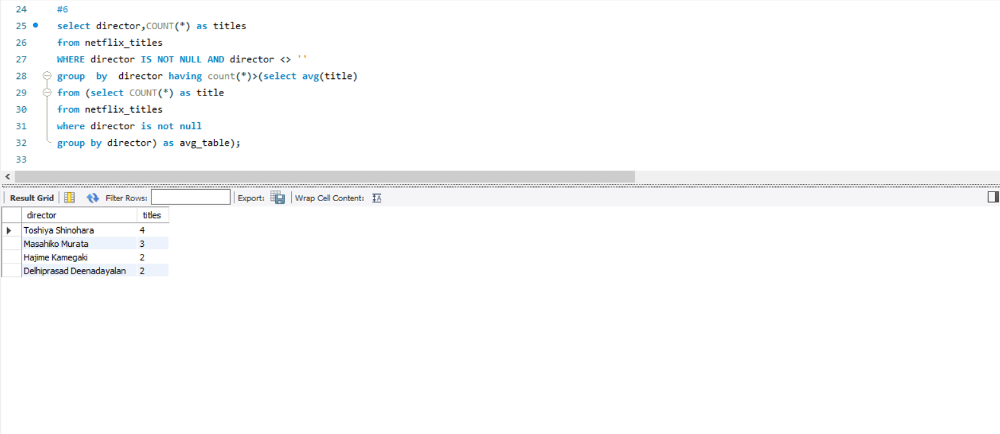
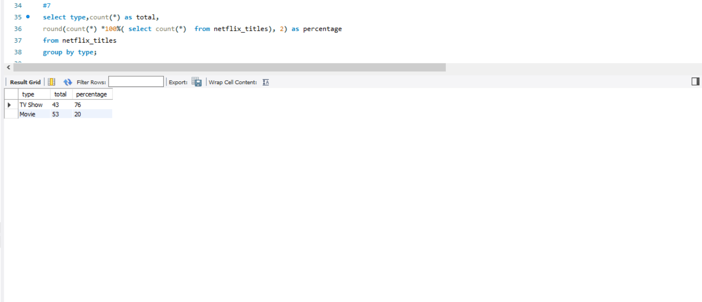
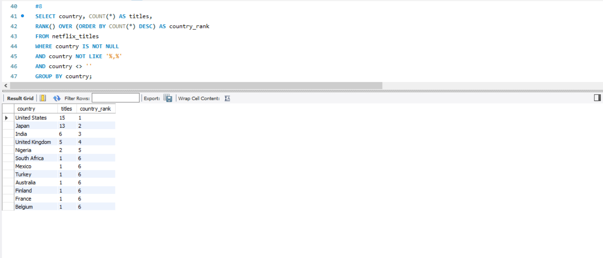
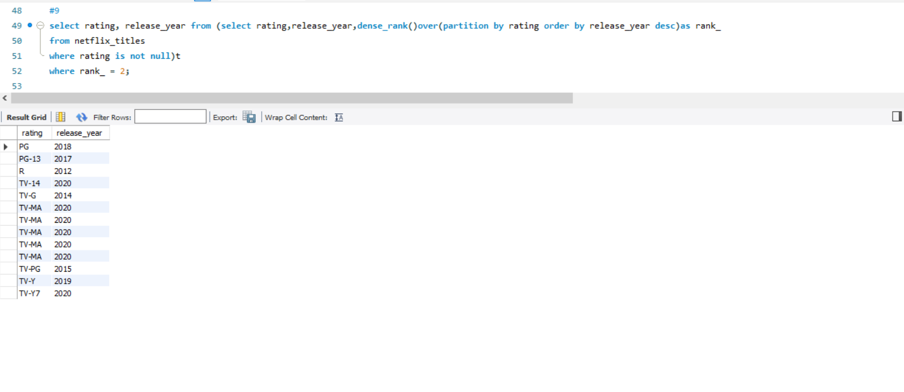

# 📊 Netflix Data Analysis using SQL

## 📌 Project Overview
This project analyzes a Netflix dataset using SQL to uncover key insights related to content distribution, trends, and viewer ratings.

The goal is to demonstrate strong SQL skills by extracting meaningful business insights from real-world data.

---

## 📂 Dataset
- **Source:** Netflix dataset  
- **Contains:** Titles, genres, release years, countries, ratings, directors, and date added  

---

## 🛠️ Tools & Technologies
- SQL (MySQL)  
- Window Functions  
- Aggregate Functions  
- Data Cleaning (handling nulls, formatting dates)  

---

## 🔍 Key Analysis

### 🎬 Director Analysis
Identified directors with above-average number of titles.

---

### 📺 Content Type Distribution
Analyzed the proportion of Movies vs TV Shows.

---

### 🌍 Country-wise Ranking
Ranked countries based on the number of titles produced.

---

### ⭐ Rating & Release Analysis
Analyzed how content ratings vary across release years.

---

## 💡 Key Insights

- Movies dominate the platform with **53 titles**, compared to **43 TV Shows**, indicating a higher focus on movie content.

- The **United States leads with 15 titles**, followed by **Japan (13 titles)** and **India (6 titles)**, showing strong content production from these regions.

- A small group of directors contributes disproportionately to the content:
  - Toshiya Shinohara – 4 titles  
  - Masahiko Murata – 3 titles  
  - Hajime Kamegaki – 2 titles  

- The majority of content was added in **2021 (96 titles)**, suggesting a significant growth spike during that year.

- Ratings such as **TV-MA, TV-14, and PG-13** are the most common, indicating a focus on mature and teen audiences.

---

## ✅ Conclusion
This project demonstrates the ability to transform raw data into actionable insights using SQL. It highlights skills in data cleaning, querying, and analytical thinking, which are essential for data analyst roles.

